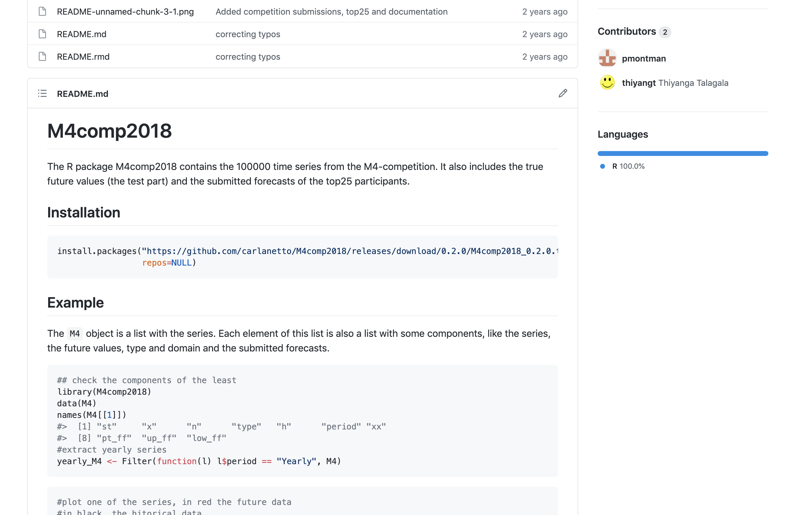
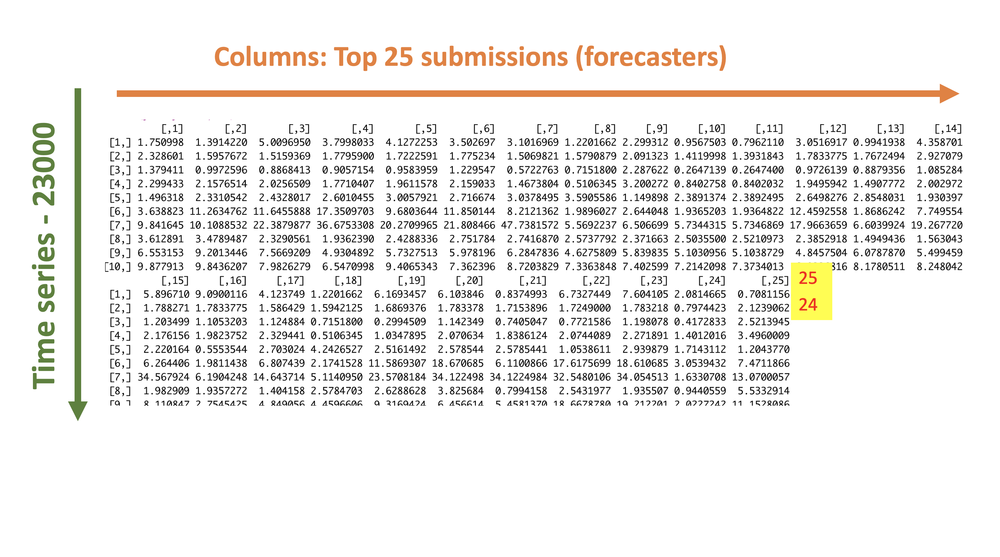
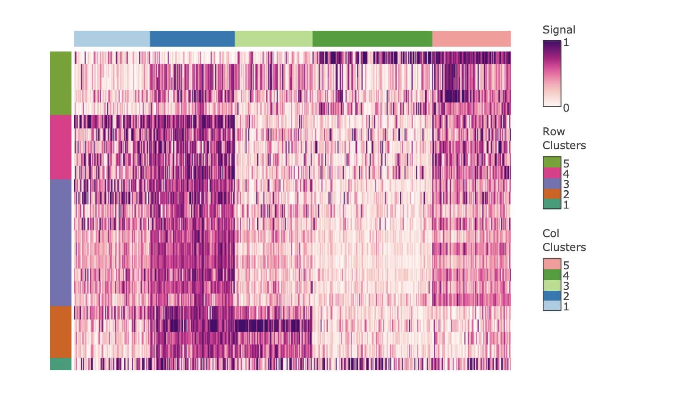

```{r setup, include=FALSE}
options(htmltools.dir.version = FALSE)
knitr::opts_chunk$set(
  fig.width=9, fig.height=3.5, fig.retina=3,
  out.width = "100%",
  cache = FALSE,
  echo = TRUE,
  message = FALSE, 
  warning = FALSE,
  fig.show = TRUE,
  hiline = TRUE
)
```

```{r xaringan-themer, include=FALSE, warning=FALSE}
library(xaringanthemer)
style_duo_accent(
  primary_color = "#1381B0",
  secondary_color = "#FF961C",
  inverse_header_color = "#FFFFFF"
)
```

## Forecasting competitions

.pull-left[


]


.pull-right[

- 100000 time series

- Performance measures for point forecasts: **overall weighted average (OWA)**

    - Mean Absolute Scale Error (MASE)
    
    - symmetric Mean Absolute Percentage Error (sMAPE)


]
---


.pull-left[

## Results

```{r   out.width = "90%", echo = FALSE, fig.cap=''}
knitr::include_graphics("m4results.jpg")
```


Source: Forecasting with high frequency data: M4 competition and beyond, IJF, 2020

]

.pull-right[

## R Package: `M4comp2018`



]

---

## Motivation


---
## Motivation


---

## Motivation


---

## Motivation


---

## Motivation


```{r, comment=NA, echo=FALSE}
library(here)
load(here("data", "yearly_MASE.rda"))
```

```{r, comment=NA}
colMeans(yearly_MASE)
```


```{r, fig.height=3, comment=NA, echo=FALSE, message=FALSE, warning=FALSE}
library(tidyverse)
meanMASE <- colMeans(yearly_MASE)
rank <- as.factor(1:25)
df <- data.frame(M4rank=rank, meanMASE = meanMASE)
ggplot(df, aes(x=M4rank, y=meanMASE)) + geom_bar(stat = "identity", width = 0.9, colour="#bdbdbd", fill="#081d58") + xlab("M4 competition rank") + ylab("mean MASE")

```


]

---

## Motivation



---

## Motivation


---

## Results: labeled according to the lowest MASE

```{r, comment=NA, message=FALSE, echo=FALSE}
load(here("data", "yearly_MASE_rank.rda"))
yearly_MASE_rank
```


---

## Composition of labels 

```{r, comment=NA, message=FALSE, warning=FALSE, echo=FALSE, fig.height=3}
load(here("data", "yearly_MASE_rank.rda"))
table(yearly_MASE_rank)
M4rank <- as.factor(1:25)
rank1 <- as.vector(table(yearly_MASE_rank))
df2 <- data.frame(x=M4rank, rank1=rank1)
ggplot(df2, aes(x=x, y=rank1)) +
geom_bar(stat = "identity", width = 0.9, colour="#bdbdbd", fill="#e7298a") + xlab("M4 competition rank") + ylab("Number of rank 1 counts")
```


---
## Composition of labels and mean MASE

```{r, comment=NA, message=FALSE, warning=FALSE, echo=FALSE, fig.height=2}
load(here("data", "yearly_MASE_rank.rda"))
M4rank <- as.factor(1:25)
rank1 <- as.vector(table(yearly_MASE_rank))
df2 <- data.frame(x=M4rank, rank1=rank1)
ggplot(df2, aes(x=x, y=rank1)) +
geom_bar(stat = "identity", width = 0.9, colour="#bdbdbd", fill="#e7298a") + xlab("M4 competition rank") + ylab("Number of rank 1 counts")
```

```{r, comment=NA, message=FALSE, warning=FALSE, echo=FALSE, fig.height=2}
meanMASE <- colMeans(yearly_MASE)
rank <- as.factor(1:25)
df <- data.frame(M4rank=rank, meanMASE = meanMASE)
ggplot(df, aes(x=M4rank, y=meanMASE)) + geom_bar(stat = "identity", width = 0.9, colour="#bdbdbd", fill="#081d58") + xlab("M4 competition rank") + ylab("mean MASE")
```

---

## Distribution of MASE values

```{r, comment=NA, message=FALSE, warning=FALSE, echo=FALSE, fig.height=4}
library(tidyverse)
yearly_MASE_df <- as.data.frame(yearly_MASE)
ggplot(stack(yearly_MASE_df), aes(x=ind, y=values)) + geom_boxplot(coef=1e30) + xlab("Forecaster") + ylab("MASE")

```

---

.pull-left[

forecaster-1

```{r, comment=NA, message=FALSE, echo=FALSE}
library(matrixStats)
load("data/yearly_MASE.rda")
rankmat <- rowRanks(yearly_MASE)
yearly_MASE_rank_df <- as.data.frame(rankmat)
yearly_MASE_rank_stack <- stack(yearly_MASE_rank_df)

forecaster <- as.factor(rep(1:25, each=25))
rank <- as.factor(rep(1:25, times=25))
values <- c(as.numeric(table(rankmat[,1])),
  as.numeric(table(rankmat[,2])),
  as.numeric(table(rankmat[,3])),
  as.numeric(table(rankmat[,4])),
  as.numeric(table(rankmat[,5])),
  as.numeric(table(rankmat[,6])),
  as.numeric(table(rankmat[,7])),
  as.numeric(table(rankmat[,8])),
  as.numeric(table(rankmat[,9])),
  as.numeric(table(rankmat[,10])),
  as.numeric(table(rankmat[,11])),
  as.numeric(table(rankmat[,12])),
  as.numeric(table(rankmat[,13])),
  as.numeric(table(rankmat[,14])),
  as.numeric(table(rankmat[,15])),
  as.numeric(table(rankmat[,16])),
  as.numeric(table(rankmat[,17])),
  as.numeric(table(rankmat[,18])),
  as.numeric(table(rankmat[,19])),
  as.numeric(table(rankmat[,20])),
  as.numeric(table(rankmat[,21])),
  as.numeric(table(rankmat[,22])),
  as.numeric(table(rankmat[,23])),
  as.numeric(table(rankmat[,24])),
  as.numeric(table(rankmat[,25])))
yearly_rank_viz <- data.frame(forecaster=forecaster,
                              rank=rank,
                              values=values)
head(yearly_rank_viz, 25)

```
]

.pull-right[

forecaster-25

```{r, comment=NA, message=FALSE, echo=FALSE}
tail(yearly_rank_viz, 25)

```


]


---
## Distribution of ranks by forecasters

```{r, comment=NA, warning=FALSE, message=FALSE, echo=FALSE, fig.height=4}
library(matrixStats)
load("data/yearly_MASE.rda")
rankmat <- rowRanks(yearly_MASE)
yearly_MASE_rank_df <- as.data.frame(rankmat)
yearly_MASE_rank_stack <- stack(yearly_MASE_rank_df)

forecaster <- as.factor(rep(1:25, each=25))
rank <- as.factor(rep(1:25, times=25))
values <- c(as.numeric(table(rankmat[,1])),
  as.numeric(table(rankmat[,2])),
  as.numeric(table(rankmat[,3])),
  as.numeric(table(rankmat[,4])),
  as.numeric(table(rankmat[,5])),
  as.numeric(table(rankmat[,6])),
  as.numeric(table(rankmat[,7])),
  as.numeric(table(rankmat[,8])),
  as.numeric(table(rankmat[,9])),
  as.numeric(table(rankmat[,10])),
  as.numeric(table(rankmat[,11])),
  as.numeric(table(rankmat[,12])),
  as.numeric(table(rankmat[,13])),
  as.numeric(table(rankmat[,14])),
  as.numeric(table(rankmat[,15])),
  as.numeric(table(rankmat[,16])),
  as.numeric(table(rankmat[,17])),
  as.numeric(table(rankmat[,18])),
  as.numeric(table(rankmat[,19])),
  as.numeric(table(rankmat[,20])),
  as.numeric(table(rankmat[,21])),
  as.numeric(table(rankmat[,22])),
  as.numeric(table(rankmat[,23])),
  as.numeric(table(rankmat[,24])),
  as.numeric(table(rankmat[,25])))
yearly_rank_viz <- data.frame(forecaster=forecaster,
                              rank=rank,
                              values=values)
ggplot(yearly_rank_viz, aes(fill=rank, y=values, x=forecaster)) + 
  geom_bar(position="fill", stat="identity") +
  scale_fill_viridis_d(option = 'magma') +
  coord_flip() + ylab("Proportion of ranks") + xlab("Forecaster")
```

---

## Distribution of ranks by forecasters

```{r, comment=NA, warning=FALSE, message=FALSE, echo=FALSE, fig.height=4}
ggplot(yearly_rank_viz, aes(fill=rank, y=values, x=forecaster)) + 
  geom_bar(position="fill", stat="identity") + 
  scale_fill_brewer(palette="PRGn") +
  #scale_fill_viridis(discrete = T) +
  coord_flip() + ylab("Proportion of ranks") + xlab("Forecaster")

```

---


---

## Time series features

```{r, comment=NA, echo=FALSE}
load(here("data", "full.yearly.rda"))
colnames(full.yearly)[-c(1, 2, 3, 42)]
```

--

## t-distributed stochastic neighbor embedding (t-SNE)


The goal is to take a set of points in a high-dimensional space and find a representation of those points in a lower-dimensional space, while preserving the local structure of the high dimensional data (that is to group neighboring data points together).


---

## Forecasting Model Territories

```{r, comment=NA, warning=FALSE, message=FALSE, echo=FALSE, fig.height=4}
load(here("data", "full.yearly.rda"))
load(here("data", "tsne.rda"))
full.yearly.nonmiss <- full.yearly %>% select(where(~!any(is.na(.))))
#yearly.analysis <- full.yearly.nonmiss %>% select(-c(frequency, nperiods, seasonal_period, bestrank))
#library(Rtsne)
## Executing the algorithm on curated data
#tsne <- Rtsne(full.yearly.nonmiss, dims = 2, perplexity=30, verbose=TRUE, max_iter = 1000, check_duplicates = FALSE, pca=FALSE)
full.yearly.nonmiss$y1 <- tsne$Y[, 1]
full.yearly.nonmiss$y2 <- tsne$Y[, 2]
full.yearly.nonmiss <- full.yearly.nonmiss %>% mutate(f1 = ifelse(bestrank==1, 1, 0))
full.yearly.nonmiss <- full.yearly.nonmiss %>% mutate(f25 = ifelse(bestrank==25, 25, 0))
full.yearly.nonmiss <- full.yearly.nonmiss %>% mutate(f2 = ifelse(bestrank==2, 2, 0))
full.yearly.nonmiss <- full.yearly.nonmiss %>% mutate(f3 = ifelse(bestrank==3, 3, 0))
full.yearly.nonmiss <- full.yearly.nonmiss %>% mutate(f4 = ifelse(bestrank==4, 4, 0))
full.yearly.nonmiss <- full.yearly.nonmiss %>% mutate(f5 = ifelse(bestrank==5, 5, 0))
full.yearly.nonmiss <- full.yearly.nonmiss %>% mutate(f6 = ifelse(bestrank==6, 6, 0))
full.yearly.nonmiss$f1 <- as.factor(full.yearly.nonmiss$f1)
full.yearly.nonmiss$f25 <- as.factor(full.yearly.nonmiss$f25)
d1 <- full.yearly.nonmiss %>% filter(f1==1)
d25 <- full.yearly.nonmiss %>% filter(f25==25)
p1 <- ggplot(full.yearly.nonmiss, aes(x=y1, y=y2, col=f1))+geom_point(alpha=0.5, size=0.3) + 
  scale_colour_manual(values=c( "#1b9e77", "#d95f02"), labels = c("other", "forecaster 1"))+ geom_point(data=d1, aes(x=y1, y=y2), colour="#d95f02",size=0.3) +
  ggtitle("Forecaster-01") + xlab("tsne component 1") + ylab("tsne component 2")  + theme(legend.position = "bottom") +  theme(legend.title = element_blank(), aspect.ratio=1) + coord_equal() 
p2 <- ggplot(full.yearly.nonmiss, aes(x=y1, y=y2, col=f25))+geom_point(alpha=0.5, size=0.3)+
  scale_colour_manual(values=c( "#1b9e77", "#7570b3"), labels = c("other", "forecaster 25"))+ geom_point(data=d25, aes(x=y1, y=y2), colour="#7570b3", size=0.3) + ggtitle("Forecaster-25") + 
  xlab("tsne component 1") + ylab("tsne component 2") + theme(legend.position = "bottom", aspect.ratio=1) +  theme(legend.title = element_blank())
library(patchwork)
p1|p2
```

---


```{r, echo=FALSE, warning=FALSE, message=FALSE, fig.height=5}
full.yearly.nonmiss$f2 <- as.factor(full.yearly.nonmiss$f2)
full.yearly.nonmiss$f3 <- as.factor(full.yearly.nonmiss$f3)
full.yearly.nonmiss$f4 <- as.factor(full.yearly.nonmiss$f4)
full.yearly.nonmiss$f5 <- as.factor(full.yearly.nonmiss$f5)
full.yearly.nonmiss$f6 <- as.factor(full.yearly.nonmiss$f6)

d1 <- full.yearly.nonmiss %>% filter(f1==1)
d2 <- full.yearly.nonmiss %>% filter(f2==2)
d3 <- full.yearly.nonmiss %>% filter(f3==3)
d4 <- full.yearly.nonmiss %>% filter(f4==4)
d5 <- full.yearly.nonmiss %>% filter(f5==5)
d6 <- full.yearly.nonmiss %>% filter(f6==6)


f1 <- ggplot(full.yearly.nonmiss, aes(x=y1, y=y2, col=f1))+geom_point(alpha=0.5, size=0.2) +
  scale_colour_manual(values=c( "#1b9e77", "#e7298a"))+ ggtitle("Forecaster-1") + xlab("tsne component 1") + ylab("tsne component 2") + theme(legend.position = "none", aspect.ratio=1) + geom_point(data=d1, aes(x=y1, y=y2), colour="#e7298a", size=0.2)
f2 <- ggplot(full.yearly.nonmiss, aes(x=y1, y=y2, col=f2))+geom_point(alpha=0.5, size=0.2)+
  scale_colour_manual(values=c( "#1b9e77", "#e7298a"))+ ggtitle("Forecaster-2") + geom_point(data=d2, aes(x=y1, y=y2), colour="#e7298a", size=0.2)+
  xlab("tsne component 1") + ylab("tsne component 2") + theme(legend.position = "none", aspect.ratio=1)
f3 <- ggplot(full.yearly.nonmiss, aes(x=y1, y=y2, col=f3))+geom_point(alpha=0.5, size=0.2)+
  scale_colour_manual(values=c( "#1b9e77", "#e7298a"))+ ggtitle("Forecaster-3") + geom_point(data=d3, aes(x=y1, y=y2), colour="#e7298a", size=0.2) +
  xlab("tsne component 1") + ylab("tsne component 2") + theme(legend.position = "none", aspect.ratio=1)
f4 <- ggplot(full.yearly.nonmiss, aes(x=y1, y=y2, col=f4))+geom_point(alpha=0.5, size=0.2)+ geom_point(data=d4, aes(x=y1, y=y2), colour="#e7298a", size=0.2)+
  scale_colour_manual(values=c( "#1b9e77", "#e7298a"))+ ggtitle("Forecaster-4") + 
  xlab("tsne component 1") + ylab("tsne component 2") + theme(legend.position = "none", aspect.ratio=1)
f5 <- ggplot(full.yearly.nonmiss, aes(x=y1, y=y2, col=f5))+geom_point(alpha=0.5, size=0.2)+ geom_point(data=d5, aes(x=y1, y=y2), colour="#e7298a", size=0.2)+
  scale_colour_manual(values=c( "#1b9e77", "#e7298a"))+ ggtitle("Forecaster-5") + 
  xlab("tsne component 1") + ylab("tsne component 2") + theme(legend.position = "none", aspect.ratio=1)
f6 <- ggplot(full.yearly.nonmiss, aes(x=y1, y=y2, col=f6))+geom_point(alpha=0.5, size=0.2, size=0.2)+geom_point(data=d6, aes(x=y1, y=y2), colour="#e7298a", size=0.2)+
  scale_colour_manual(values=c( "#1b9e77", "#e7298a"))+ ggtitle("Forecaster-6") + 
  xlab("tsne component 1") + ylab("tsne component 2") + theme(legend.position = "none", aspect.ratio=1)

(f1|f2|f3)/(f4|f5|f6)

```


---


```{r, echo=FALSE, warning=FALSE, message=FALSE, fig.height=5}
full.yearly.nonmiss <- full.yearly.nonmiss %>% mutate(f24 = ifelse(bestrank==24, 24, 0))
full.yearly.nonmiss <- full.yearly.nonmiss %>% mutate(f23 = ifelse(bestrank==23, 23, 0))
full.yearly.nonmiss <- full.yearly.nonmiss %>% mutate(f22 = ifelse(bestrank==22, 22, 0))
full.yearly.nonmiss <- full.yearly.nonmiss %>% mutate(f21 = ifelse(bestrank==21, 21, 0))
full.yearly.nonmiss <- full.yearly.nonmiss %>% mutate(f20 = ifelse(bestrank==20, 20, 0))
full.yearly.nonmiss <- full.yearly.nonmiss %>% mutate(f19 = ifelse(bestrank==19, 19, 0))

full.yearly.nonmiss$f20 <- as.factor(full.yearly.nonmiss$f20)
full.yearly.nonmiss$f21 <- as.factor(full.yearly.nonmiss$f21)
full.yearly.nonmiss$f22 <- as.factor(full.yearly.nonmiss$f22)
full.yearly.nonmiss$f23 <- as.factor(full.yearly.nonmiss$f23)
full.yearly.nonmiss$f24 <- as.factor(full.yearly.nonmiss$f24)
full.yearly.nonmiss$f25 <- as.factor(full.yearly.nonmiss$f25)

d19 <- full.yearly.nonmiss %>% filter(f19==19)
d20 <- full.yearly.nonmiss %>% filter(f20==20)
d21 <- full.yearly.nonmiss %>% filter(f21==21)
d22 <- full.yearly.nonmiss %>% filter(f22==22)
d23 <- full.yearly.nonmiss %>% filter(f23==23)
d24 <- full.yearly.nonmiss %>% filter(f24==24)
d25 <- full.yearly.nonmiss %>% filter(f25==25)

f25 <- ggplot(full.yearly.nonmiss, aes(x=y1, y=y2, col=f25))+geom_point(alpha=0.5, size=0.2) +
  scale_colour_manual(values=c( "#1b9e77", "#e7298a"))+ ggtitle("Forecaster-25") + xlab("tsne component 1") + ylab("tsne component 2") + theme(legend.position = "none", aspect.ratio=1) + geom_point(data=d25, aes(x=y1, y=y2), colour="#e7298a", size=0.2)
f20 <- ggplot(full.yearly.nonmiss, aes(x=y1, y=y2, col=f20))+geom_point(alpha=0.5, size=0.2)+
  scale_colour_manual(values=c( "#1b9e77", "#e7298a"))+ ggtitle("Forecaster-20") + geom_point(data=d20, aes(x=y1, y=y2), colour="#e7298a", size=0.2)+
  xlab("tsne component 1") + ylab("tsne component 2") + theme(legend.position = "none", aspect.ratio=1)
f21 <- ggplot(full.yearly.nonmiss, aes(x=y1, y=y2, col=f21))+geom_point(alpha=0.5, size=0.2)+
  scale_colour_manual(values=c( "#1b9e77", "#e7298a"))+ ggtitle("Forecaster-21") + geom_point(data=d21, aes(x=y1, y=y2), colour="#e7298a", size=0.2) +
  xlab("tsne component 1") + ylab("tsne component 2") + theme(legend.position = "none", aspect.ratio=1)
f22 <- ggplot(full.yearly.nonmiss, aes(x=y1, y=y2, col=f22))+geom_point(alpha=0.5, size=0.2)+ geom_point(data=d22, aes(x=y1, y=y2), colour="#e7298a", size=0.2)+
  scale_colour_manual(values=c( "#1b9e77", "#e7298a"))+ ggtitle("Forecaster-22") + 
  xlab("tsne component 1") + ylab("tsne component 2") + theme(legend.position = "none", aspect.ratio=1)
f23 <- ggplot(full.yearly.nonmiss, aes(x=y1, y=y2, col=f23))+geom_point(alpha=0.5, size=0.2)+ geom_point(data=d23, aes(x=y1, y=y2), colour="#e7298a", size=0.2)+
  scale_colour_manual(values=c( "#1b9e77", "#e7298a"))+ ggtitle("Forecaster-23") + 
  xlab("tsne component 1") + ylab("tsne component 2") + theme(legend.position = "none", aspect.ratio=1)
f24 <- ggplot(full.yearly.nonmiss, aes(x=y1, y=y2, col=f24))+geom_point(alpha=0.5, size=0.2, size=0.2)+geom_point(data=d24, aes(x=y1, y=y2), colour="#e7298a", size=0.2)+
  scale_colour_manual(values=c( "#1b9e77", "#e7298a"))+ ggtitle("Forecaster-24") + 
  xlab("tsne component 1") + ylab("tsne component 2") + theme(legend.position = "none", aspect.ratio=1)

(f20|f21|f22)/(f23|f24|f25)

```

---

#### Distribution of features

```{r, comment=NA, message=FALSE, warning=FALSE, echo=FALSE, fig.height=5}
library(viridis)
library(viridisLite)
f25 <- ggplot(full.yearly.nonmiss, aes(x=y1, y=y2, col=trend))+geom_point(alpha=0.5, size=0.2) +
  ggtitle("trend") + xlab("tsne component 1") + ylab("tsne component 2") + theme(aspect.ratio=1) + scale_color_viridis()

f20 <- ggplot(full.yearly.nonmiss, aes(x=y1, y=y2, col=alpha))+geom_point(alpha=0.5, size=0.2)+
  ggtitle("alpha") + 
  xlab("tsne component 1") + ylab("tsne component 2") + theme( aspect.ratio=1) + scale_color_viridis()

f21 <- ggplot(full.yearly.nonmiss, aes(x=y1, y=y2, col=x_acf1))+geom_point(alpha=0.5, size=0.2)+
  ggtitle("x_acf1") + 
  xlab("tsne component 1") + ylab("tsne component 2") + theme(aspect.ratio=1) +  scale_color_viridis()

f22 <- ggplot(full.yearly.nonmiss, aes(x=y1, y=y2, col=beta))+geom_point(alpha=0.5, size=0.2)+ 
ggtitle("beta") + 
  xlab("tsne component 1") + ylab("tsne component 2") + theme(aspect.ratio=1) +  scale_color_viridis()

f23 <- ggplot(full.yearly.nonmiss, aes(x=y1, y=y2, col=entropy))+geom_point(alpha=0.5, size=0.2)+
 ggtitle("entropy") + 
  xlab("tsne component 1") + ylab("tsne component 2") + theme(aspect.ratio=1) +  scale_color_viridis()

f24 <- ggplot(full.yearly.nonmiss, aes(x=y1, y=y2, col=diff1_acf1))+geom_point(alpha=0.5, size=0.2, size=0.2)+
 ggtitle("diff1_acf1") + 
  xlab("tsne component 1") + ylab("tsne component 2") + theme( aspect.ratio=1) +  scale_color_viridis()


(f25|f21|f24)/(f23|f20|f22)
```


---

#### Heatmap visualization of MASE

rows: time series, columns: forecasters, cell: MASE

```{r   out.width = "90%", echo = FALSE, fig.cap=''}

```


---


class: center, middle

# Thank You!

```{r, echo=FALSE}
anicon::faa("twitter", animate="float", size=3, colour="lightblue")
```

```{r, echo=FALSE}
anicon::faa("github", animate="float", size=3, colour="black")
```

# @thiyangt


### web: https://thiyanga.netlify.app/talk/isf21-talk/

email: ttalagala@sjp.ac.lk


