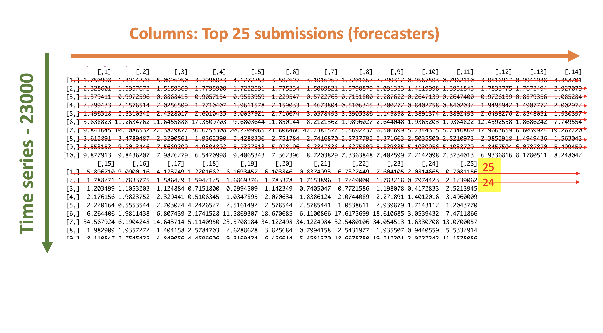

```{r setup, include=FALSE}
options(htmltools.dir.version = FALSE)
knitr::opts_chunk$set(
  fig.width=9, fig.height=3.5, fig.retina=3,
  out.width = "100%",
  cache = FALSE,
  echo = TRUE,
  message = FALSE, 
  warning = FALSE,
  fig.show = TRUE,
  hiline = TRUE
)
```

```{r xaringan-themer, include=FALSE, warning=FALSE}
library(xaringanthemer)
style_duo_accent(
  primary_color = "#1381B0",
  secondary_color = "#FF961C",
  inverse_header_color = "#FFFFFF"
)
```

## Forecasting competitions

.pull-left[


]


.pull-right[

- 100000 time series

- performance measures for point forecasts: **overall weighted average (OWA)**

    - Mean Absolute Scale Error (MASE)
    
    - symmetric Mean Absolute Percentage Error (sMAPE)


]
---


.pull-left[

## Results

```{r   out.width = "90%", echo = FALSE, fig.cap=''}

```


Source: Forecasting with high frequency data: M4 competition and beyond, IJF, 2020

]

.pull-right[

## R Package: `M4comp2018`


]

---

## Motivation


---
## Motivation


---

## Motivation


---

## Motivation


---

## Motivation


```{r, comment=NA, echo=FALSE}
library(here)
load(here("data", "yearly_MASE.rda"))
```

```{r, comment=NA}
colMeans(yearly_MASE)
```


```{r, fig.height=3, comment=NA, echo=FALSE, message=FALSE, warning=FALSE}
library(tidyverse)
meanMASE <- colMeans(yearly_MASE)
rank <- as.factor(1:25)
df <- data.frame(M4rank=rank, meanMASE = meanMASE)
ggplot(df, aes(x=M4rank, y=meanMASE)) + geom_bar(stat = "identity", width = 0.9, colour="#bdbdbd", fill="#081d58") + xlab("M4 competition rank") + ylab("mean MASE")

```


]

---

## Motivation


---

## Motivation



---
class: center, middle

# Thanks you!

Slides created via the R packages:

[**xaringan**](https://github.com/yihui/xaringan)<br>
[gadenbuie/xaringanthemer](https://github.com/gadenbuie/xaringanthemer)

The chakra comes from [remark.js](https://remarkjs.com), [**knitr**](http://yihui.name/knitr), and [R Markdown](https://rmarkdown.rstudio.com).
